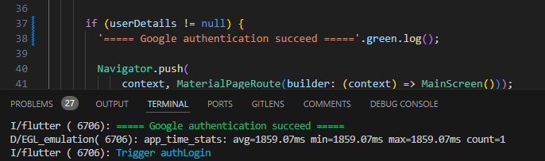

# color_simp

A simple Dart package that adds colorful console logging using ANSI escape codes.

## Features

- Easily apply colors to console output.
- Supports **red, green, yellow, blue, magenta, cyan**.
- Provides a `log()` method to print colored text directly.
- Includes prevent prints on production mode.

## Getting Started

To use `color_simp`, add it as a dependency in your `pubspec.yaml`:

```yaml
dependencies:
  color_simp: latest_version
```

Then, run:

```sh
dart pub get
```

## Usage

```dart
import 'package:color_simp/color_simp.dart';

void main() {
  "Its very easy on green".green.log();
  "Its very easy on red also".red.log();
  "Same on yellow".yellow.log();
}
```

### Output Example:



## Running Tests

To ensure everything works as expected, run:

```sh
dart test
```

## Contributing

Contributions are welcome! If you find a bug or have an idea for an improvement:

1. Fork the repository.
2. Create a feature branch.
3. Submit a pull request.

## Issues

If you encounter any issues, feel free to open an issue on [GitHub](https://github.com/mtndbs/color_simp/issues).

## License

This project is licensed under the MIT License. See the `LICENSE` file for details.
